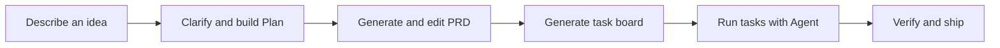

# The Architech

**Turn a rough idea into a buildable project.**

The Architech is a local-first AI workbench for moving from product intuition to an executable delivery plan:

```text
Idea → Plan → PRD → Agent-ready tasks → Implementation
```

Describe what you want to build, clarify the missing pieces, shape the architecture, and hand a coding agent a task board with concrete files, dependencies, prompts, and verification steps.

<p>
  <strong>Bring your own model.</strong> Connect a hosted provider, a local model, or any compatible endpoint.<br />
  <strong>Keep control.</strong> Sessions live in SQLite, workspaces are explicitly selected, and shell access is opt-in.<br />
  <strong>Stay in the flow.</strong> Plan, specify, export, and run tasks from one workbench.
</p>

## What you can do

| Capability | Outcome |
| --- | --- |
| Conversational intake | Start with an idea and let the Agent ask focused follow-up questions. |
| Project planning | Generate an editable summary, audience, value proposition, features, tech stack, architecture, Mermaid diagrams, roadmap, and estimate. |
| PRD generation | Turn the plan into a structured seven-point PRD, with optional extra sections and a Markdown view. |
| Task planning | Break the PRD into atomic coding tasks with target files, dependencies, instructions, and verification steps. |
| Task execution | Run a task in the Agent panel, update its status, and watch the Kanban board move from To do to Done. |
| Export | Download the plan, PRD, `AGENTS.md`, or a complete project bundle. |
| Model routing | Use Codex, Claude Code, Antigravity, or an API connection; autodetect available models and native effort levels. |
| MCP tools | Add external tools through stdio or Streamable HTTP without changing application code. |

## The workflow



### 1. Plan

Use the Agent for a conversation-first intake, or fill the form manually. The planning step produces:

- project summary, target audience, and value proposition;
- core features and suggested tech stack;
- architecture and data-flow views, including Mermaid diagrams;
- phased roadmap, effort estimate, resources, and risks.

The generated feature list is editable. If the feature scope changes, the plan can be synchronized again before moving on.

### 2. PRD

Generate a requirements document from the approved plan. The PRD covers overview, requirements, core features by phase, user flow, architecture, database schema, and tech stack. Review it in the structured view, edit the source fields, or inspect the generated Markdown.

### 3. Send to Agent

Generate a ready-to-run task board. Each task includes a stable ID, priority, target files, dependencies, instructions, and verification steps. Use Kanban or detailed list view, drag tasks between states, run an individual task, copy prompts, or download `AGENTS.md` for another coding agent.

## Connect a model

Open **Connections** in the sidebar and add a provider preset or a custom connection. The connection editor supports:

- `Anthropic Messages` and `OpenAI compatible` wire formats;
- base URL, model list, optional API key, and custom headers;
- enabled/disabled and JSON-mode settings;
- role bindings for `Agent`, `Plan`, `PRD`, and `Tasks`.

Included presets cover local routers, Ollama, LM Studio, OpenRouter, Anthropic, Gemini (OpenAI-compatible), and custom endpoints. No provider or model is bundled with the app.

### API keys

Keys saved through the UI are stored server-side in `data/architech.db`; protect that file and its backups. To keep a key out of the database, put the variable name in **API key environment variable** and define the value in `.env`.

```bash
cp .env.example .env
```

The example file includes:

| Variable | Typical use |
| --- | --- |
| `OPENAI_API_KEY` | OpenAI-compatible endpoints |
| `OPENROUTER_API_KEY` | OpenRouter |
| `ANTHROPIC_API_KEY` | Anthropic-format endpoints |
| `GEMINI_API_KEY` | Gemini compatibility or legacy fallback |
| `ANTHROPIC_AUTH_TOKEN` | Legacy compatibility only |

The app does not automatically choose one provider or one API-key variable. Select the variable explicitly on each connection.

## Give the Agent a workspace

The Agent can work with project files only after **Working folder** is set. Paths are resolved inside that folder, with symlink checks.

- File tools: `list_files`, `read_file`, `read_files`, `glob`, `grep`, `write_file`, and `edit_file`.
- Shell tool: `run_command`, available only after **Allow shell commands** is enabled.
- File writes and shell commands require approval.
- Shell access is disabled when no workspace is selected, and is off by default.

If you enable shell access, the model can run commands in the selected folder. Review approvals carefully, especially for destructive commands or commands that access the network.

## Add MCP servers

Open **Connections → MCP** to register external tools. The built-in client currently supports the MCP tool subset needed by the Agent:

| Transport | Configure with | Behavior |
| --- | --- | --- |
| `stdio` | command, one argument per line, environment JSON | Spawns the server on demand and speaks newline-delimited JSON-RPC. |
| Streamable HTTP | server URL and headers JSON | Uses JSON responses or Server-Sent Events and keeps the MCP session ID. |

MCP tools are discovered lazily, namespaced as `mcp__<server>__<tool>`, and isolated from built-in tools. A slow or unavailable server does not prevent the Agent turn from continuing; the UI receives an MCP status notice instead.

The current scope is `initialize`, `tools/list`, and `tools/call`. MCP `sampling`, `roots`, `elicitation`, `prompts`, and `resources` are intentionally outside the current UI and client scope.

## Quick start

### Requirements

- Codex, Claude Code, Antigravity, or a reachable model endpoint. The app does not ship with an AI model.
- Node.js **22.14+** only if you run from source. The desktop app bundles its own runtime.

### Desktop app

Download an installer from the [latest release](https://github.com/CharisChakim/the-architech/releases/latest):

| Platform | File | Notes |
| --- | --- | --- |
| Windows | `TheArchitech-Setup-<version>-x64.exe` | Installs per user; you can pick the directory. |
| Linux | `TheArchitech-<version>-x86_64.AppImage` | Portable. `chmod +x` it, then run it. |
| Linux (Debian/Ubuntu) | `TheArchitech-<version>-amd64.deb` | `sudo apt install ./<file>.deb` |

The desktop build runs the same local server, picks a free port instead of
3000, and listens on `127.0.0.1` only. It keeps its data outside the install
directory:

| Platform | Data and `.env` location |
| --- | --- |
| Windows | `%APPDATA%\The Architech` |
| Linux | `~/.config/The Architech` |

The database is at `data/architech.db` inside that folder. To supply API keys
through environment variables rather than the UI, put a `.env` file there.

The installers are unsigned, so Windows SmartScreen will warn on first run
("More info" → "Run anyway") and some Linux desktops will ask you to confirm
the AppImage is executable.

### Run from source

**Linux / macOS**

```bash
curl -fsSLO https://raw.githubusercontent.com/CharisChakim/the-architech/main/install.sh
bash install.sh
the-architech
```

**Windows PowerShell**

```powershell
Invoke-WebRequest https://raw.githubusercontent.com/CharisChakim/the-architech/main/install.ps1 -OutFile install.ps1
powershell -ExecutionPolicy Bypass -File .\install.ps1
```

Then run `%LOCALAPPDATA%\TheArchitech\start-the-architech.cmd`.

For development from an existing checkout:

```bash
npm install
npm run dev
```

Open [http://localhost:3000](http://localhost:3000), configure a model connection, and start a project. Sessions are created automatically once a project has a title.

### Production build

```bash
npm run build
npm start
```

The development command runs the Vite client and API server together. The production command runs the bundled server from `dist/`.

## Useful commands

| Command | Purpose |
| --- | --- |
| `npm run dev` | Start the Vite client and API server on port 3000 with server watching. |
| `npm run build` | Build the client and bundle the server into `dist/server.cjs`. |
| `npm start` | Run the production server. |
| `npm run lint` | Type-check the project with `tsc --noEmit`. |
| `npm run clean` | Remove generated build output. |

## Data and security notes

- Project sessions, saved connections, role bindings, and MCP server definitions are stored in `data/architech.db`.
- `data/` is runtime state and should not be committed.
- API keys returned by the connections API are represented only by `hasKey`; the secret value is not sent back to the browser.
- Choose a workspace deliberately. The Agent has no file access until you provide one.
- Treat shell approval as code execution authority, not as a convenience toggle.

## Built with

React 19 · TypeScript · Vite · Express · Node `node:sqlite` · Tailwind CSS · Mermaid · Lucide

## Project layout

```text
src/                    React UI, workflow steps, state, exports, and i18n
server/                 API routes, LLM adapters, agent loop, and MCP client
db.ts                   SQLite bootstrap and session persistence
docs/harness/            Phase-by-phase implementation notes
data/                   Local runtime database (created on first run)
```

The UI is available in English and Bahasa Indonesia, with light and dark themes.
